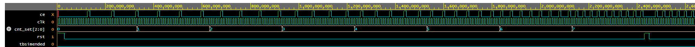
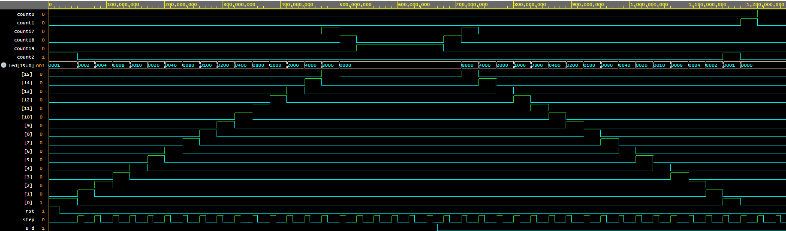
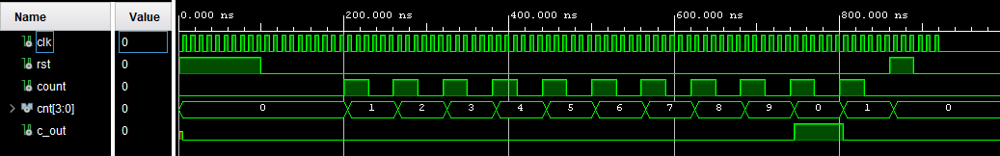
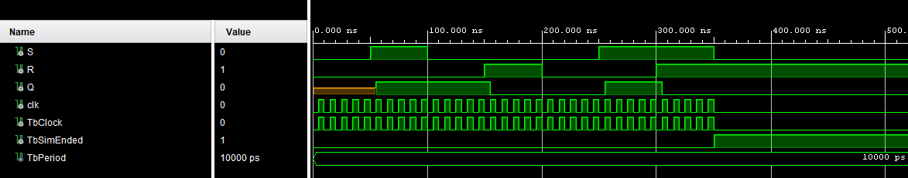
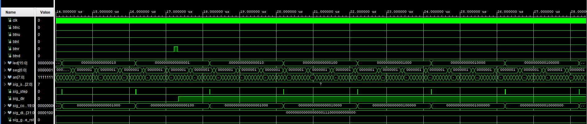

# LED Ping-Pong

Semester project for the Digital Electronics 1 course. The project implements a simple two-player LED Ping-Pong reaction game in VHDL for the Nexys A7-50T FPGA board. One active LED represents the ball moving between the players. The players return the ball using push buttons near the edges of the playing field. If a player misses the ball, the opponent receives a point.

## Team

- Jakub Kriva
- Jonas Salich
- Pavel Stastny

## Project Description

The game uses 16 onboard LEDs, five push buttons and the seven-segment display. The ball moves across the LED field and its direction changes when the correct player button is pressed at the correct edge position. The ball speed can be changed using `btnu` and `btnd`. The current score and speed setting are displayed on the seven-segment display.

After reset, the game returns to its initial state. The `clk` signal is the main system clock and `btnc` is used as reset. The `clk_en2` block generates movement pulses for the ball and the `cnt_b_bd` block stores the current speed setting.

## Demo Video

The following video shows the LED Ping-Pong game running on the FPGA board.

<video src="pingPong.mp4" controls width="720">
  Your browser does not support embedded videos. You can open the video file directly: [pingPong.mp4](pingPong.mp4).
</video>

[Open demo video](pingPong.mp4)

## Block Diagram

## Top-Level I/O Ports

Top-level component: [PingPong_top.vhd](LED-PingPong/src/PingPong_top.vhd)

| Port | Direction | Width | Description |
| --- | --- | ---: | --- |
| `clk` | input | 1 | Main clock signal from the Nexys A7-50T board. |
| `btnc` | input | 1 | Center push button used as game reset. |
| `btnl` | input | 1 | Left player push button. |
| `btnr` | input | 1 | Right player push button. |
| `btnu` | input | 1 | Increases the ball speed. |
| `btnd` | input | 1 | Decreases the ball speed. |
| `led` | output | 16 | LED field showing the current ball position. |
| `seg` | output | 7 | Seven-segment display segment outputs. |
| `an` | output | 8 | Seven-segment display anode selection outputs. |

## Repository Structure

| Folder | Content |
| --- | --- |
| `LED-PingPong/src/` | VHDL source components. |
| `LED-PingPong/sim/` | Testbenches and simulation files. |
| `LED-PingPong/sim/img/` | Simulation waveform screenshots. |
| `LED-PingPong/constr/` | XDC constraints for the Nexys A7-50T board. |
| `LED-PingPong/vivado/` | Vivado project files. |
| `LED-PingPong/docs/` | Additional documentation and outputs. |
| `LED-PingPong/statistics/` | Synthesis and implementation statistics. |

## Main Components

| Component | File | Role in the Project |
| --- | --- | --- |
| `PingPong_top` | [LED-PingPong/src/PingPong_top.vhd](LED-PingPong/src/PingPong_top.vhd) | Connects the complete game: buttons, ball movement, score counters and display output. |
| `cnt_d_bd` | [LED-PingPong/src/cnt_d_bd.vhd](LED-PingPong/src/cnt_d_bd.vhd) | Ball position counter and LED output generator. |
| `cnt_b_bd` | [LED-PingPong/src/cnt_b_bd.vhd](LED-PingPong/src/cnt_b_bd.vhd) | 3-bit counter used for speed setting. |
| `clk_en2` | [LED-PingPong/src/clk_en2.vhd](LED-PingPong/src/clk_en2.vhd) | Adjustable clock-enable generator for game speed. |
| `clk_en` | [LED-PingPong/src/clk_en.vhd](LED-PingPong/src/clk_en.vhd) | Clock-enable generator used by helper blocks. |
| `debounce` | [LED-PingPong/src/debounce.vhd](LED-PingPong/src/debounce.vhd) | Removes push-button bouncing. |
| `counter10` | [LED-PingPong/src/counter10.vhd](LED-PingPong/src/counter10.vhd) | Decimal score counter. |
| `display_driver` | [LED-PingPong/src/display_driver.vhd](LED-PingPong/src/display_driver.vhd) | Seven-segment display multiplexing. |
| `bin2seg` | [LED-PingPong/src/bin2seg.vhd](LED-PingPong/src/bin2seg.vhd) | Converts a 4-bit value to seven-segment outputs. |
| `RSFlipFlop` | [LED-PingPong/src/RSFlipFlop.vhd](LED-PingPong/src/RSFlipFlop.vhd) | RS flip-flop used for storing the ball direction. |
| `counter` | [LED-PingPong/src/counter.vhd](LED-PingPong/src/counter.vhd) | Generic counter used in display-related blocks. |

## Simulations

All simulation results are included directly in this README. A separate simulation document is no longer needed. Waveform screenshots are stored in [LED-PingPong/sim/img](LED-PingPong/sim/img).

### Simulated Blocks Overview

| Simulation | Component | Screenshot | Testbench |
| --- | --- | --- | --- |
| `clk_en` | [clk_en.vhd](LED-PingPong/src/clk_en.vhd) | [clk_en.png](LED-PingPong/sim/img/clk_en.png) | [tb_clk_en.vhd](LED-PingPong/sim/tb_clk_en.vhd) |
| `cnt_b_bd` | [cnt_b_bd.vhd](LED-PingPong/src/cnt_b_bd.vhd) | [cnt_b_bd_tb.png](LED-PingPong/sim/img/cnt_b_bd_tb.png) | [tb_cnt_b_bd.vhd](LED-PingPong/sim/tb_cnt_b_bd.vhd) |
| `cnt_d_bd` | [cnt_d_bd.vhd](LED-PingPong/src/cnt_d_bd.vhd) | [cnt_d_bd.png](LED-PingPong/sim/img/cnt_d_bd.png) | [tb_cnt_d_bd.vhd](LED-PingPong/sim/tb_cnt_d_bd.vhd) |
| `display_driver` | [display_driver.vhd](LED-PingPong/src/display_driver.vhd) | [display_driver_tb.png](LED-PingPong/sim/img/display_driver_tb.png) | [display_driver_tb.vhd](LED-PingPong/sim/display_driver_tb.vhd) |
| `counter10` | [counter10.vhd](LED-PingPong/src/counter10.vhd) | [counter10_tb.png](LED-PingPong/sim/img/counter10_tb.png) | [counter10_tb.vhd](LED-PingPong/sim/counter10_tb.vhd) |
| `RSFlipFlop` | [RSFlipFlop.vhd](LED-PingPong/src/RSFlipFlop.vhd) | [RSFlipFlop_sim.png](LED-PingPong/sim/img/RSFlipFlop_sim.png) | [RSFlipFlop_tb.vhd](LED-PingPong/sim/RSFlipFlop_tb.vhd) |
| `PingPong_top` | [PingPong_top.vhd](LED-PingPong/src/PingPong_top.vhd) | [TOP_sim.png](LED-PingPong/sim/img/TOP_sim.png) | [PingPong_top_tb.vhd](LED-PingPong/sim/PingPong_top_tb.vhd) |

### `clk_en` Simulation

Component: [LED-PingPong/src/clk_en.vhd](LED-PingPong/src/clk_en.vhd) 
Testbench: [LED-PingPong/sim/tb_clk_en.vhd](LED-PingPong/sim/tb_clk_en.vhd)

The `clk_en` block generates a one-clock-cycle `ce` pulse used as a clock enable for other logic. The simulation verifies reset behavior, internal counter operation and generation of the enable pulse.

Verified behavior:

- after reset, `ce` is cleared
- `ce` is active for only one clock cycle
- the internal counter returns to zero after reaching its maximum value

### `cnt_b_bd` Simulation

Component: [LED-PingPong/src/cnt_b_bd.vhd](LED-PingPong/src/cnt_b_bd.vhd) 
Testbench: [LED-PingPong/sim/tb_cnt_b_bd.vhd](LED-PingPong/sim/tb_cnt_b_bd.vhd)

The `cnt_b_bd` block is a 3-bit speed-setting counter. The `count_up` and `count_down` inputs change the value of the `count(2:0)` output.

Verified behavior:

- reset sets `count` to `000`
- `count_up` increments the value
- `count_down` decrements the value
- the counter saturates at `000` and `111`
- simultaneous up and down pulses do not change the value

### `cnt_d_bd` Simulation

Component: [LED-PingPong/src/cnt_d_bd.vhd](LED-PingPong/src/cnt_d_bd.vhd) 
Testbench: [LED-PingPong/sim/tb_cnt_d_bd.vhd](LED-PingPong/sim/tb_cnt_d_bd.vhd)

The `cnt_d_bd` block represents the ball position. The internal position is counted from 0 to 19. Positions 2 to 17 are visible on the LED field, while positions 0, 1, 18 and 19 are used for edge and overflow detection.

Verified behavior:

- reset returns the ball to its initial position
- `step` moves the ball by one position
- `u_d = '1'` moves the ball to the right
- `u_d = '0'` moves the ball to the left
- `led(15:0)` shows the active ball position
- `count0`, `count1`, `count2`, `count17`, `count18` and `count19` indicate edge states

### `display_driver` Simulation

Component: [LED-PingPong/src/display_driver.vhd](LED-PingPong/src/display_driver.vhd) 
Testbench: [LED-PingPong/sim/display_driver_tb.vhd](LED-PingPong/sim/display_driver_tb.vhd)

The `display_driver` block receives 32-bit display data for eight display positions and an anode enable mask. The simulation verifies digit multiplexing, the `seg(6:0)` output and active anode selection through `anode(7:0)`.

Verified behavior:

- individual nibbles from `data(31:0)` are multiplexed to `seg(6:0)`
- `anode(7:0)` selects the active display position
- disabled anodes remain inactive

### `counter10` Simulation

Component: [LED-PingPong/src/counter10.vhd](LED-PingPong/src/counter10.vhd) 
Testbench: [LED-PingPong/sim/counter10_tb.vhd](LED-PingPong/sim/counter10_tb.vhd)

The `counter10` block is a decimal score counter. It counts from 0 to 9, returns to 0 after overflow and activates the `c_out` output for the next digit.

Verified behavior:

- reset sets the counter to 0
- the `count` input adds one point
- the value stays in the range from 0 to 9
- after 9, the counter returns to 0 and generates `c_out`

### `RSFlipFlop` Simulation

Component: [LED-PingPong/src/RSFlipFlop.vhd](LED-PingPong/src/RSFlipFlop.vhd) 
Testbench: [LED-PingPong/sim/RSFlipFlop_tb.vhd](LED-PingPong/sim/RSFlipFlop_tb.vhd)

The `RSFlipFlop` block stores a state according to the `S` and `R` inputs. In the project, it is used to remember the ball direction.

Verified behavior:

- `S = 1`, `R = 0` sets `Q` to 1
- `S = 0`, `R = 1` resets `Q` to 0
- `S = 0`, `R = 0` keeps the previous state
- invalid state `S = 1`, `R = 1` is handled by resetting the output to 0

### `PingPong_top` Simulation

Component: [LED-PingPong/src/PingPong_top.vhd](LED-PingPong/src/PingPong_top.vhd) 
Testbench: [LED-PingPong/sim/PingPong_top_tb.vhd](LED-PingPong/sim/PingPong_top_tb.vhd)

The top-level simulation verifies the connection of the main game blocks: debounced inputs, speed setting, ball movement, direction change, score counting and LED/display outputs.

Verified behavior:

- reset of the complete game
- ball movement across the LED field
- response to the left and right player buttons
- speed change using `btnu` and `btnd`
- score increment after ball overflow
- display data preparation for the seven-segment display

## Project Statistics

Project statistics are stored in [LED-PingPong/statistics](LED-PingPong/statistics). The screenshots below show the Vivado resource utilization results for the final design. The full text report is available as a separate file: [utilization_report01.txt](LED-PingPong/statistics/utilization_report01.txt).

## Constraints

Constraints for the Nexys A7-50T board are located in [LED-PingPong/constr/nexys.xdc](LED-PingPong/constr/nexys.xdc). They assign pins for the system clock, push buttons, LEDs and seven-segment display.

## Tools

- Vivado 2025.2
- VHDL
- Nexys A7-50T

## References

- Project assignment: [VHDL projects 2026](https://github.com/tomas-fryza/vhdl-examples/blob/master/lab8-project/README_2026.md)
- Digilent Nexys A7 reference manual
