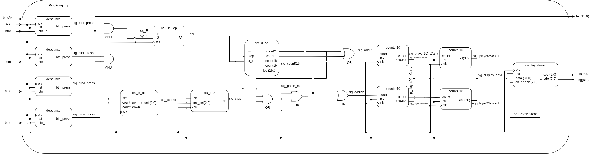
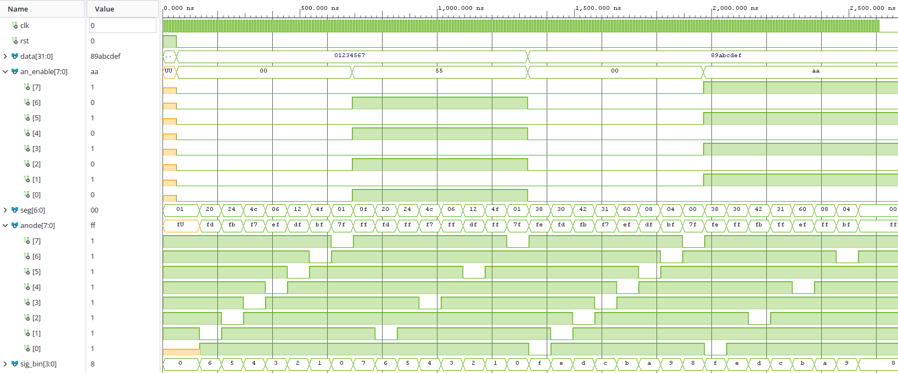

# LED Ping-Pong

Digital Electronics 1 project focused on a simple two-player LED Ping-Pong game in VHDL for the Nexys A7-50T FPGA board.

## Team

- Jakub Kriva
- Jonas Salich
- Pavel Stastny

## Project Description

The goal is to create a reaction game using the 16 onboard LEDs and push buttons. A moving LED represents the ball. When the ball reaches one side, the player must press the button in time to return it. If the player misses, the opponent wins the round.

## Block Diagram

## Main Parts

- `ball_controller` for ball movement and hit or miss detection
- `button handling` for player input synchronization
- `game control` for round logic and reset
- `LED output logic` for displaying the game state

## Hardware

- Nexys A7-50T
- 16 onboard LEDs
- Push buttons

## Repository Structure

- `src/` VHDL source files
- `sim/` simulation files and testbenches
- `constr/` XDC constraints
- `vivado/` Vivado project files
- `docs/` screenshots, poster, and video output

## References and Tools

- Course assignment: [VHDL projects 2026](https://github.com/tomas-fryza/vhdl-examples/blob/master/lab8-project/README_2026.md)
- Development environment: Vivado 2025.2
- Language: VHDL

## Components and their testbenches

### display_driver

- This component is used to display players score and difficulty level. It takes 32 bit input data vector, which is splited between individual displays. Input signal an_enable enables individual displays and is active-low.
- Input data vactor is split by four bits per display, using 8 individual displays.
- The result vawe of component test simulation is:

