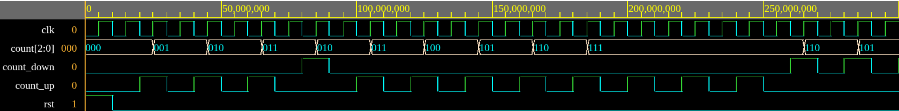

# Simulation Results

This document describes the simulations used to verify the main
components of the LED Ping-Pong project. The simulations were prepared
for the individual blocks before connecting them into the final
top-level design.

## Simulated Blocks

| Testbench | Tested component | Purpose |
| --- | --- | --- |
| `tb_clk_en` | `clk_en` | Verifies generation of the clock enable signal for different speed settings. |
| `tb_cnt_b_bd.vhd` | `cnt_b_bd` | Verifies the speed setting counter controlled by `count_up` and `count_down`. |
| `tb_cnt_d_bd` | `cnt_d_bd` | Verifies the ball position counter and LED output mapping. |
| `tb_display_driver` | `display_driver` | Verifies seven-segment display output and anode selection. |

## `clk_en` Simulation

The `clk_en` block generates the `ce` signal used to move the ball.
The input `cnt_set(2:0)` changes the speed setting. Lower values
produce slower enable pulses and higher values produce faster enable
pulses.

Verified behavior:

- after reset, `ce` is cleared
- `ce` is generated as a one-clock pulse
- different `cnt_set` values change the period of the `ce` pulse
- reset works correctly during operation

Important signals:

| Signal | Description |
| --- | --- |
| `clk` | Main simulation clock. |
| `rst` | Active-high reset. |
| `cnt_set(2:0)` | Speed setting input. |
| `ce` | Clock enable output for ball movement. |

Screenshot:

```text
Add Vivado waveform screenshot here.
```

## `cnt_b_bd` Simulation

The `cnt_b_bd` block is a 3-bit counter used for setting the ball
speed. It is controlled by two input pulses, `count_up` and
`count_down`.

Verified behavior:

- reset sets `count` to `000`
- `count_up` increments the counter
- `count_down` decrements the counter
- the counter stops at `111` when increasing
- the counter stops at `000` when decreasing
- simultaneous `count_up` and `count_down` do not change the value

Important signals:

| Signal | Description |
| --- | --- |
| `clk` | Main simulation clock. |
| `rst` | Active-high reset. |
| `count_up` | Pulse for increasing the speed setting. |
| `count_down` | Pulse for decreasing the speed setting. |
| `count(2:0)` | Current speed setting. |

Screenshot:



The waveform shows reset, incrementing with `count_up`, decrementing
with `count_down`, and saturation at the maximum value `111`.

## `display_driver` Simulation

The `display_driver` block receives display data and an enable mask for
the anodes. It generates the `seg(6:0)` output for the active digit and
selects the currently enabled display position using `anode(7:0)`.

Verified behavior:

- display data are multiplexed to the seven-segment output
- `seg(6:0)` changes according to the selected digit value
- `anode(7:0)` selects the active display position
- disabled anodes remain inactive

Important signals:

| Signal | Description |
| --- | --- |
| `clk` | Main simulation clock. |
| `rst` | Active-high reset. |
| `data(31:0)` | Values prepared for display. |
| `an_enable(7:0)` | Enable mask for display anodes. |
| `seg(6:0)` | Seven-segment output. |
| `anode(7:0)` | Active display position selection. |

Screenshot:


## `cnt_d_bd` Simulation

The `cnt_d_bd` block represents the ball position counter. The ball
position is internally counted from 0 to 19. Positions 2 to 17 are
displayed on `LED(15:0)`. Positions 0, 1, 18 and 19 are used for edge
and overflow detection.

Verified behavior:

- reset sets the ball to the initial position
- `step` moves the ball by one position
- `u_d = '1'` moves the ball to the right
- `u_d = '0'` moves the ball to the left
- `LED(15:0)` shows one active LED while the ball is inside the field
- `count0`, `count1`, `count2`, `count17`, `count18` and `count19`
  indicate important edge or overflow positions

Important signals:

| Signal | Description |
| --- | --- |
| `rst` | Active-high reset. |
| `u_d` | Ball direction, `1` for right and `0` for left. |
| `step` | Pulse that moves the ball by one position. |
| `led(15:0)` | LED output showing the ball position. |
| `count0` | Left overflow position. |
| `count1` | Position before the left edge. |
| `count2` | First visible LED position. |
| `count17` | Last visible LED position. |
| `count18` | Position after the right edge. |
| `count19` | Right overflow position. |

Screenshot:

```text
Add Vivado waveform screenshot here.
```

## Summary

The simulations verify the basic behavior of the main building blocks:
speed control, clock enable generation and ball movement across the
LED field. These blocks will later be connected in the top-level design
together with debounce logic, score counters and the display driver.
